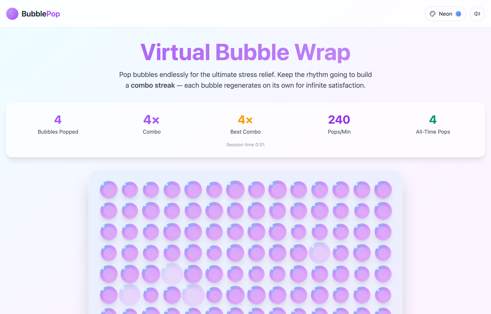
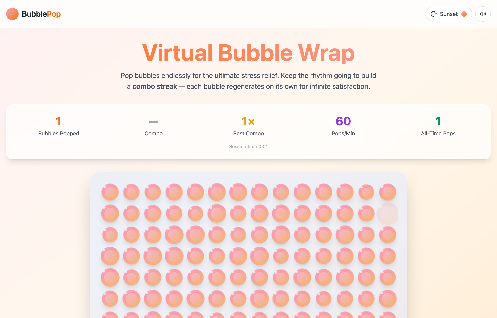
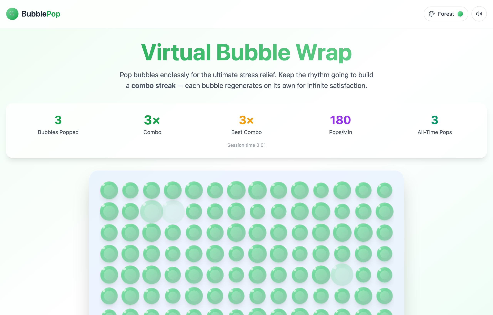
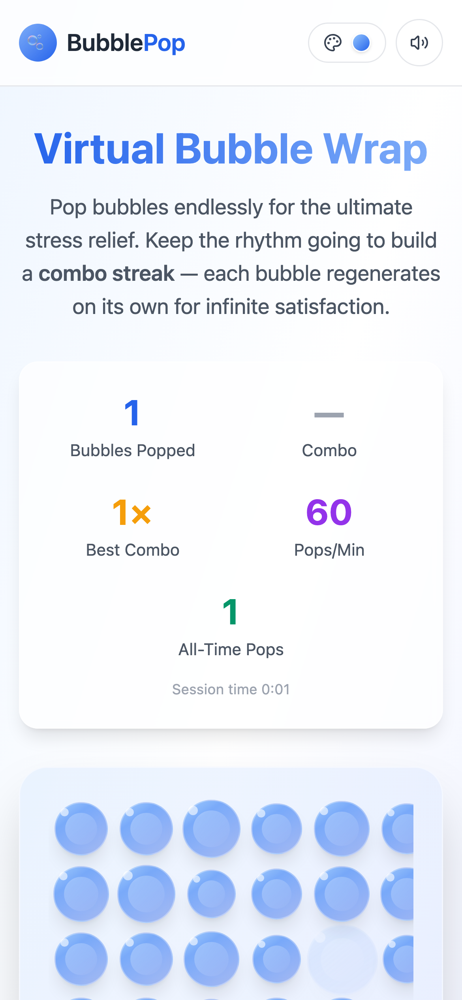

<div align="center">

# 🫧 Bubble Pop — Virtual Bubble Wrap

### Endless, oddly-satisfying bubble wrap that lives in your browser.

*No downloads. No sign-up. No actual plastic harmed. Just pop.*


[**▶ Live demo**](#-live-demo) · [Quick start](#-quick-start) · [Features](#-features) · [How it works](#-how-it-works)


</div>

---

## 🎈 What is this?

We've all been there: a fresh sheet of bubble wrap, and that primal need to pop
*every last one*. **Bubble Pop** is that feeling, bottled — an infinite grid of
bubbles that burst with a satisfying little sound and regenerate on their own, so
you never run out. It's a tiny stress-relief toy you can open in a tab and close
before anyone notices.

Warning: mildly addictive. We're not sorry. 🫧

## ✨ Features

- **♾️ Infinite bubbles** — pop one and it quietly refills a few seconds later. The sheet never ends.
- **🔥 Combo streaks** — keep a steady rhythm and your combo climbs. Break the beat and it resets. Chase that **Best Combo**.
- **🎨 Six themes** — Ocean, Sunset, Neon, Forest, Candy, and Midnight. The whole sheet re-skins instantly.
- **🔊 Satisfying pops** — crisp, synthesized pop sounds (Web Audio, zero audio files) that get brighter as your combo grows. Mute anytime.
- **📊 Live stats** — bubbles popped, current combo, best combo, pops-per-minute, and an all-time counter that remembers you.
- **📱 Mobile-first** — responsive grid, tap-friendly bubbles, and a little haptic buzz on supported devices.
- **💾 Remembers you** — best combo, all-time pops, theme, and sound preference persist in `localStorage`.

## 🖼️ Themes

| Neon | Sunset | Forest |
|:---:|:---:|:---:|
|  |  |  |

<div align="center">
  
  <br/><em>Pops just as nicely on your phone.</em>
</div>

## 🚀 Live demo

🌐 **[Coming soon](#)** — deploying to Cloudflare Pages. (Link drops here once it's live.)

## 🏁 Quick start

**Never touched a Node project before? No stress — here's every step.**

You'll need **[Node.js](https://nodejs.org/) 18 or newer** (which includes `npm`).
Check what you have:

```sh
node -v   # should print v18.x or higher
```

Then:

```sh
# 1. Grab the code
git clone https://github.com/waleedsworld/bubblepop.git
cd bubblepop

# 2. Install the dependencies (one time, grab a coffee ☕)
npm install

# 3. Start the dev server
npm run dev
```

Open the URL it prints (**http://localhost:8080**) and start popping. Edit any
file in `src/` and the page reloads instantly. That's it — you're a bubble-wrap
developer now. 🎉

### Handy scripts

| Command | What it does |
|---|---|
| `npm run dev` | Start the dev server with hot reload |
| `npm run build` | Build the production bundle into `dist/` |
| `npm run preview` | Preview that production build locally |
| `npm run lint` | Lint the code |

## 🧠 How it works

- **The grid** (`BubbleGrid.tsx`) measures your window and lays out a responsive
  field of bubbles, regenerating any that were popped on a short timer.
- **Each bubble** (`Bubble.tsx`) handles its own pop animation and a tiny particle
  burst, coloured by the active theme.
- **Combos** (`Index.tsx`) — pop again within 1.2 seconds to extend your streak;
  pause too long and it resets to zero. Your best is saved.
- **Themes** (`hooks/useTheme.tsx` + `lib/themes.ts`) paint a set of CSS variables
  onto `<html>`, so bubbles, background, accents, and particles all re-skin from one place.
- **Sound** (`hooks/useSound.tsx`) synthesizes each pop live with the Web Audio API —
  no audio files shipped, and the pitch brightens as your combo climbs.

## 🛠️ Tech stack

**Vite** · **React 18** · **TypeScript** · **Tailwind CSS** · **shadcn/ui** · **Web Audio API**

## 📁 Project structure

```
src/
├── components/
│   ├── Bubble.tsx        # one bubble: render, pop animation, particles
│   ├── BubbleGrid.tsx    # responsive grid + regeneration loop
│   ├── Header.tsx        # logo, theme picker, sound toggle
│   └── StatsPanel.tsx    # live stats row
├── hooks/
│   ├── useTheme.tsx      # theme context + persistence
│   └── useSound.tsx      # Web Audio pop synth + mute
├── lib/
│   └── themes.ts         # the six palettes
└── pages/
    └── Index.tsx         # game state: combos, counters, layout
```

## 🤝 Contributing

Found a bug or have a wild theme idea (Lava Lamp? Galaxy?)? Open an issue or a PR —
new palettes are just a few lines in `src/lib/themes.ts`.

## 📄 License

MIT — pop freely.
